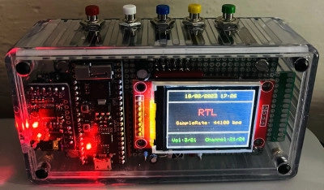

# ESP32 Internet Radio
This project is downloaded from [Elektor ESP32 Internet radio project](https://www.elektormagazine.com/labs/esp32-internet-radio-1).
Excellent audio performance for this easy to use radio, able to decode most internet station formats ! Updated firmware and Web Server.
I have built several internet radios.
During my tests, I concluded that the ESP32 was the perfect processor for this type of application.
There are many existing projects on the web, however all had flaws that prevented me from fully appreciating an easy-to-use radio.

Mine has the following main characteristics:
- Standard ESP32 module (no additional PSRAM needed).
- 160x128 pixel color TFT display
- Use of the I2S port of the ESP32 to digitize the audio stream.
- Use of a PCM5102 type I2S module with 3.5mm stereo jack output or two MAX98357 type I2S modules with integrated class D amplifier and 2x3W RMS loudspeaker output. These modules are easily found on internet shops (see photos).
- Decoding of the following audio formats: mp3, m3u, aac, wav, adts mp4 from 32 kbps to 192 kbps.
This makes it possible to listen to virtually any internet audio stream.
- 99 stations can be defined in the software source.
- Integration of an IR receiver - VS1838B
- 5 hard keys or a universal or refurbished IR remote control (vol+, vol-, ch+, ch- and mute) are used to control the radio.
- Software optimized to avoid any slowness or rebound likely to generate background noise on the audio output.
- An emulated EEPROM stores the volume and the last station listened to.
- A led flashes to indicate the correct reception of the signals from the remote control.

Easy to  integrate in a transparent Hammond box. (pictures will be added to show this integration).
The software source indicates the connections to be made between the different modules.
The software is very simple and sufficiently documented to be easily modified. Using the Audio.h library greatly simplifies programming.
As usual, I preferred to use a hole plate and insulated wire to make my prototype.

A web server is embedded.
You can change SSID and PASSWORD.
In real time you can see : rssi value of the WiFi signal, volume, current chanel and url  of the station.

You can also easily update the firmware via OTA.

I have updated this project with a new software (version 1.60). You must also upadte LittleFS memory with the attached file. Radio stations are now alphabelicaly sorted !

A small User Manual gives some informations regarding the use and the compliation of the sofware.
The Web server is completely new !

More easy to use at first use thanks to the new WifiManager Server.

Enjoy !!!!